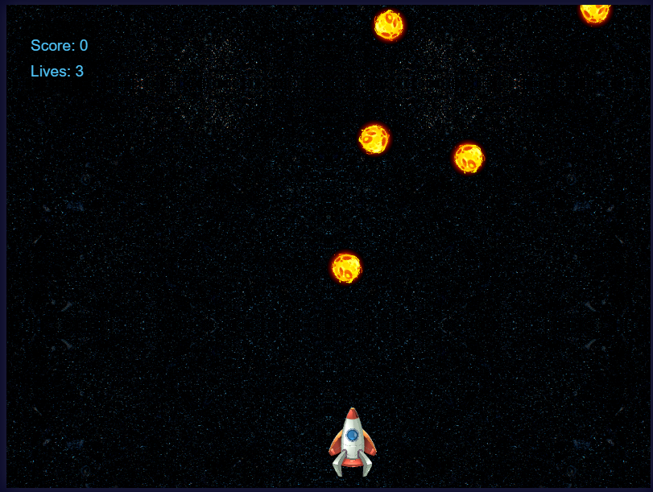

# Space Defense Game 🚀

A classic space shooter game where players defend Earth from incoming asteroids. Built with HTML5 Canvas, CSS3, and JavaScript.



## 🎮 Features

- Smooth spaceship controls
- Shooting mechanics
- Rotating asteroids
- Score tracking system
- Lives counter
- Parallax scrolling background
- Responsive design
- **Touch screen controls for Smart TV**
- **On-screen movement and attack buttons**
- Mouse and keyboard support

## 🛠️ Technologies Used

- HTML5 Canvas
- CSS3
- JavaScript
- Custom sprite assets

## 📁 Project Structure

```
space-defense/
│
├── index.html
├── styles.css
├── script.js
├── README.md
│
└── assets/
    └── img/
        ├── space-bg.png
        ├── spaceship.png
        └── asteroid.png
```

## 🎯 How to Play

### Keyboard Controls (Desktop)
1. Use Left/Right arrow keys or A/D keys to move the spaceship
2. Press Spacebar to shoot
3. Avoid colliding with asteroids
4. Destroy asteroids to score points
5. Game ends when you run out of lives

### Touch Controls (Smart TV/Touch Devices)
1. Use the ◀ ▶ buttons at the bottom to move left/right
2. Tap the 🚀 button to shoot
3. All controls are positioned outside the game canvas for easy access
4. Buttons are optimized for touch screens and Smart TV interfaces

## 🚀 Getting Started

1. Clone the repository:
```bash
git clone https://github.com/your-username/space-defense.git
```

2. Navigate to the project directory:
```bash
cd space-defense
```

3. Open `index.html` in your web browser or use a local server:
```bash
python -m http.server
```

## 🎨 Image Assets Requirements

### space-bg.png
- Size: 800x600 pixels
- Type: Seamless space background
- Format: PNG

### spaceship.png
- Size: 64x64 pixels
- Type: Player spacecraft
- Format: PNG with transparency

### asteroid.png
- Size: 48x48 pixels
- Type: Asteroid sprite
- Format: PNG with transparency

## 🎮 Game Controls

### Desktop/Keyboard Controls
- **Move Left**: Left Arrow or 'A' key
- **Move Right**: Right Arrow or 'D' key
- **Shoot**: Spacebar
- **Restart**: Click 'Play Again' button after game over

### Touch/Smart TV Controls
- **Move Left**: Touch ◀ button (bottom left)
- **Move Right**: Touch ▶ button (bottom right)
- **Shoot**: Touch 🚀 button (bottom right)
- **Restart**: Click 'Play Again' button after game over

**Note**: Touch controls are positioned outside the game canvas for optimal Smart TV experience and prevent interference with gameplay.

## 🔧 Customization

### Modifying Game Parameters
You can adjust game settings in `script.js`:

```javascript
// Player settings
player.speed = 5;        // Movement speed
player.width = 64;       // Sprite size
player.height = 64;      // Sprite size

// Bullet settings
bullet.speed = 7;        // Projectile speed
bullet.width = 4;        // Bullet size
bullet.height = 10;      // Bullet size

// Asteroid settings
asteroid.speed = 1-3;    // Random speed range
asteroid.width = 48;     // Sprite size
asteroid.height = 48;    // Sprite size
```

### Adding Custom Sprites
1. Prepare your sprite images
2. Place them in the `assets/img` directory
3. Update the image paths in `script.js`

## 🤝 Contributing

1. Fork the repository
2. Create your feature branch (`git checkout -b feature/AmazingFeature`)
3. Commit your changes (`git commit -m 'Add some AmazingFeature'`)
4. Push to the branch (`git push origin feature/AmazingFeature`)
5. Open a Pull Request

## 📝 License

This project is licensed under the MIT License 
## 👏 Acknowledgments

- Space background images
- Sprite designs
- Game design inspiration

## 🐛 Known Issues

- Mobile touch controls not yet implemented
- Some browsers may have varying performance

## 📱 Future Enhancements

- [ ] Mobile touch controls
- [ ] Power-ups system
- [ ] Different enemy types
- [ ] Sound effects
- [ ] High score system
- [ ] Difficulty levels
- [ ] Boss battles

---


